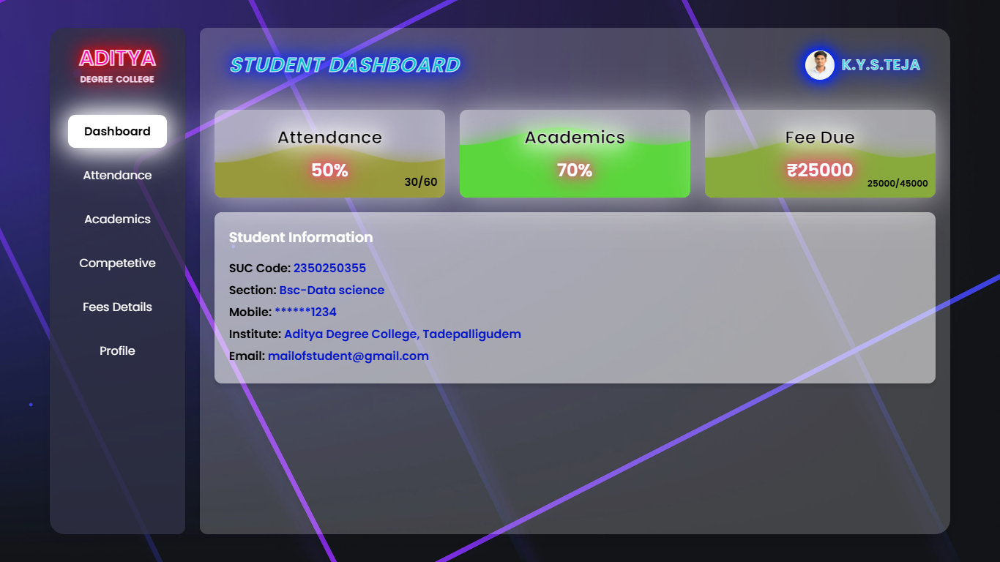

# 🌐 Neonic College Analysis Webpage

A futuristic and visually striking college analysis webpage designed using HTML and CSS. This project simulates a neon-themed digital dashboard that presents educational data in a modern UI layout. Built purely for presentation and academic learning.

---

## 🖼️ Screenshot

> Here's a preview of the homepage design:

  

---

## 🌟 Features

- Neon-glow UI and futuristic design elements  
- Clean layout with multiple sections/pages  
- Responsive and scroll-friendly structure  
- Eye-catching styling suitable for dashboards or portfolio use

---

## 🧰 Technologies Used

- HTML  
- CSS  
- JavaScript

---

---

## 🧑‍💻 Developed By

**Name:** Katta Teja  
**Course:** B.Sc Data Science  
**Email:** kattateja31@gmail.com
**Contact:** +91 70752 55834

---

## 🚀 How to View the Project

1. Download or clone this repository  
2. Make sure the `assets/` folder contains all image files  
3. Open `index.html` in any browser to explore the design

---

## 📌 Note

This project is created only for **academic** and **design showcase** purposes.  
There is no **backend** or real-time data visualization in this version.
